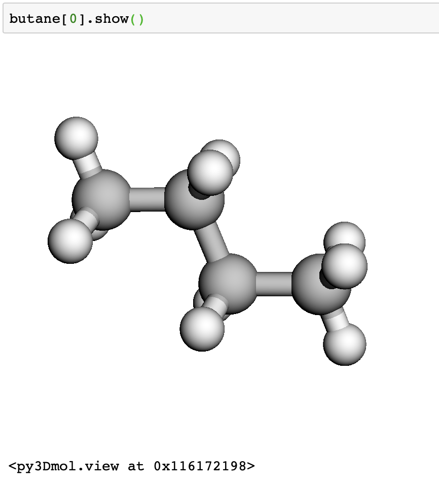
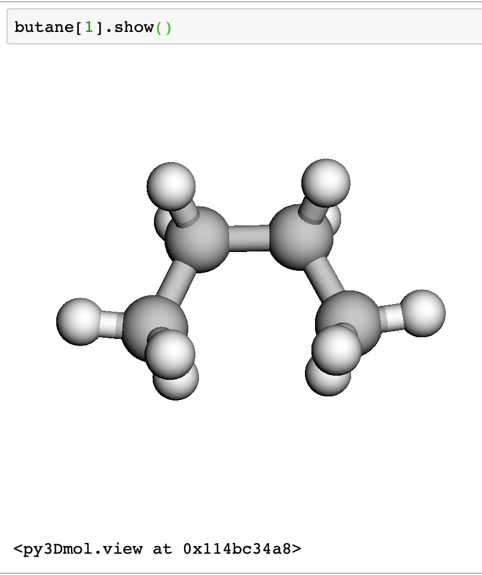

## Using QCArchive

QCArchive is a software ecosystem from MolSSI for aggregating and sharing quantum chemistry data. We are going to pull some data from QCArchive today and use the functions we've used as analysis.

If you don't have QCArchive installed, install it in your terminal using the command

~~~
$ conda install qcportal -c conda-forge
~~~
{: .language-bash}

Once `qcportal` is installed, you can import the libraries for QCArchive. We will be using [qcportal](http://docs.qcarchive.molssi.org/en/latest/) to pull data from the MolSSI instance of QCArchive.

~~~
# imports
import qcportal as ptl

# connect to qc Fractal
client = ptl.FractalClient()
~~~
{: .language-python}

~~~
FractalClient
Server:   The MolSSI QCArchive Server
Address:   https://api.qcarchive.molssi.org:443/
Username:   None
~~~
{: .output}

Next, we grab some butane molecules using their ids. We are getting a trans and cis butane, ids `61139` and `70659`.

~~~
butane = client.query_molecules(id=['61139', '70659'])
~~~

This has given us a list of QCArchive molecules.

~~~
butane
~~~
{: .language-python}

~~~
[<Molecule(name='C4H10' formula='C4H10' hash='3bbc6db')>,
 <Molecule(name='C4H10' formula='C4H10' hash='bb665a3')>]
~~~
{: .output}

We can view the structures interactively in a jupyter notebook.

~~~
butane[0].show()
~~~
{: .language-python}

~~~
butane[1].show()
~~~
{: .language-python}

Let's look at some of the methods and attributes associated with each molecule.

~~~
dir(butane[0])
~~~
{: .language-python}

~~~
['Config',
 '__abstractmethods__',
 '__annotations__',
 '__class__',
 '__config__',
 '__delattr__',
 '__dict__',
 '__dir__',
 '__doc__',
 '__eq__',
 '__fields__',
 '__fields_set__',
 '__format__',
 '__ge__',
 '__get_validators__',
 '__getattr__',
 '__getattribute__',
 '__getstate__',
 '__gt__',
 '__hash__',
 '__init__',
 '__init_subclass__',
 '__iter__',
 '__le__',
 '__lt__',
 '__module__',
 '__ne__',
 '__new__',
 '__reduce__',
 '__reduce_ex__',
 '__repr__',
 '__setattr__',
 '__setstate__',
 '__sizeof__',
 '__slots__',
 '__str__',
 '__subclasshook__',
 '__validators__',
 '__values__',
 '__weakref__',
 '_abc_impl',
 '_calculate_keys',
 '_custom_root_type',
 '_decompose_class',
 '_get_key_factory',
 '_get_value',
 '_inertial_tensor',
 '_iter',
 '_json_encoder',
 '_orient_molecule_internal',
 '_repr_html_',
 '_schema_cache',
 'align',
 'atom_labels',
 'atomic_numbers',
 'comment',
 'compare',
 'connectivity',
 'construct',
 'copy',
 'dict',
 'extras',
 'fields',
 'fix_com',
 'fix_orientation',
 'fix_symmetry',
 'fragment_charges',
 'fragment_multiplicities',
 'fragments',
 'from_data',
 'from_file',
 'from_orm',
 'geometry',
 'get_fragment',
 'get_hash',
 'get_molecular_formula',
 'hash_fields',
 'id',
 'identifiers',
 'json',
 'json_dict',
 'mass_numbers',
 'masses',
 'measure',
 'min_zero',
 'molecular_charge',
 'molecular_multiplicity',
 'must_be_3n',
 'must_be_n',
 'must_be_n_frag',
 'name',
 'nelectrons',
 'nuclear_repulsion_energy',
 'orient_molecule',
 'parse_file',
 'parse_obj',
 'parse_raw',
 'populate_real',
 'pretty_print',
 'provenance',
 'real',
 'schema',
 'schema_json',
 'schema_name',
 'schema_version',
 'scramble',
 'show',
 'symbols',
 'to_file',
 'to_string',
 'update_forward_refs',
 'validate']
~~~
{: .output}

Try out some of these, what interesting features can you find?

For our exercises today, we will be using the atomic coordinates. These are stored in the `geometry` attribute as a NumPy array.

Let's grab both of these in a list

~~~
butane_geometries = [butane[0].geometry.copy(), butane[1].geometry.copy()]
~~~
{: .language-python}

## Returning to geometry analysis

Recall from the previous lesson that we have a function for calculating distances 

~~~
def calculate_distance(rA, rB):
    """Calculate the distance between points A and B"""
    dist_vec = (rA-rB)
    distance = np.linalg.norm(dist_vec)
    return distance
~~~
{: .language-python}

In the geometry analysis project, you also had a script which looped over points in a molecule to find the bonds. Let's define this function.

~~~
def build_bond_list(coordinates, max_bond=1.55, min_bond=0):
    num_atoms = len(coordinates)
    
    for atom1 in range(num_atoms):
        for atom2 in range(atom1, num_atoms):
            distance = calculate_distance(coordinates[atom1], coordinates[atom2])

            if distance > min_bond and distance < max_bond:
                print(F'{atom1}, {atom2} : distance')
~~~
{: .language-python}

> ## Exercise
> Modify the `build_bond_list` functions so that the function returns a dictionary which has keys of the atom indices, and values of bond lengths.
>
> The keys should be something which you can use to index back into the coordinates array.
>
>> ## Answer
>> ~~~
>> def build_bond_list(coordinates, max_bond=1.55, min_bond=0):
>>     num_atoms = len(coordinates)
>>    
>>     bonds = {}
>>    
>>     for atom1 in range(num_atoms):
>>         for atom2 in range(atom1, num_atoms):
>>             distance = calculate_distance(coordinates[atom1], coordinates[atom2])
>> 
>>             if distance > min_bond and distance < max_bond:
>>                 bonds[(atom1, atom2)] = distance 
>>    
>>    return bonds
>> ~~~
>> {: .language-python}
> {: .solution}
{: .challenge}

> ## Python Dictionary Keys
>
> To make the solution store the atom indices as keys, we used a tuple. What happens if you try using a list? 
>
> Try using a list as keys (ie `[atom1, atom2]`) as keys. 
> 
> If you do this, you get a `TypeError`. This is because dictionary keys must be *immutable* types. Thus, you can use tuples, strings, or numeric types as keys, but you can't use lists.
{: .callout}

Let's try this on our butane geometry we pulled from QCArchive.

~~~
bond_list = build_bond_list(butane_geometries[0])

print(bond_list)
~~~
{: .language-python}

~~~
{}
~~~
{: .output}

We aren't getting any bonds - does this seem right?

Let's troubleshoot by querying the butane molecules from QCArchive.

~~~
butane[0].symbols
~~~
{: .language-python}

~~~
['C', 'C', 'C', 'C', 'H', 'H', 'H', 'H', 'H', 'H', 'H', 'H', 'H', 'H']
~~~

Even though we've written our own distance calculation, QCArchive actually has one built in. Let's look at it's value for the first two Carbon atoms.

~~~
qcarchive_distance = butane[0].measure([0, 1])
print(qcarchive_distance)
~~~
{: .language-python}

~~~
7.31415824856433
~~~
{: .output}

~~~
my_distance = calculate_distance(butane_geometries[0][0], butane_coordinates[0][1])
~~~
{: .language-python}

~~~
7.314158248564329
~~~
{: .output}

This is a good sign - we are getting the same as answer as QCArchive expects. 

The default bond distance value of 1.55 is appropriate if your units are angstrom. However, QCArchive stores distances in units of bohr.

We can do this conversion ourselves by googling a conversion factor, but we will another utility associated with QCArchive called `qcelemental` to get the exact conversion factor.

~~~
import qcelemental

angstrom_to_bohr = qcelemental.constants.conversion_factor("angstrom", "bohr")

print(angstrom_to_bohr)
~~~
{: .language-python}

~~~
max_length = 1.55 * angstrom_to_bohr

butane_bond = build_bond_list(butane_geometries[0], max_bond=max_length)
~~~
{: .language-python}

In the next cell, look at `butane_bonds`

~~~
butane_bonds
~~~
{: .language-python}

~~~
{(0, 2): 2.873020656801253,
 (0, 4): 2.068839651551603,
 (0, 5): 2.068484041315794,
 (0, 6): 2.068821759435787,
 (1, 3): 2.873059651780396,
 (1, 7): 2.068247482474781,
 (1, 8): 2.0685780442929644,
 (1, 9): 2.0687346633381822,
 (2, 3): 2.8862132661474598,
 (2, 10): 2.0715801221019885,
 (2, 11): 2.0716218178677623,
 (3, 12): 2.0713472807014583,
 (3, 13): 2.071754810836534}
~~~
{: .output}

Let's compare this to the connectivity QCArchive has stored.

~~~
butane[0].connectivity
~~~
{: .language-python}

~~~
[(0, 2, 1.0),
 (0, 4, 1.0),
 (0, 5, 1.0),
 (0, 6, 1.0),
 (1, 3, 1.0),
 (1, 7, 1.0),
 (1, 8, 1.0),
 (1, 9, 1.0),
 (2, 3, 1.0),
 (2, 10, 1.0),
 (2, 11, 1.0),
 (3, 12, 1.0),
 (3, 13, 1.0)]
 ~~~
 {: .output}

 The first two elements of each tuple are the atom indices, and the third is a bond order

 ## Applying our functions to a different molecule

 Next, we will look at a different kind of record in QCArchive. We are going to examine a geometry optimization.

~~~
opt = client.query_procedures(id=2658710)[0]
~~~
{: .language-python}

We can examine this object

~~~
dir(opt)
~~~
{: .language-python}

We can view the initial and final molecules

~~~
initial = opt.get_initial_molecule()
initial
~~~
{: .language-python}

~~~
final = opt.get_final_molecule()
final
~~~
{: .language-python}

We can access the coordinates in the same was as before.

~~~
initial.geometry
~~~

However, you will notice that no connectivity is defined for these molecules.

~~~
initial.connectivity
~~~

~~~
initial_bonds = build_bond_list(initial.geometry, max_bond=max_length)
final_bonds = build_bond_list(final.geometry, max_bond=max_length)
~~~

> ## Exercise
> Write a loop which will print the change in bond length from the initial configuration to the final configuration.
> 
>> ## Answer
>> ~~~
>> for k in initial_bonds:
>>     diff = final_bonds[k] - initial_bonds[k]
>>     print(k, diff)
>> ~~~
>> {: .language-python}
> {: .solution}
{: .challenge}

Now that we have a function for calculating distance, let's also create a function for calculating angles. We know that we can calculate the angle between two vectors using the dot product. 

> ## Exercise
> Write a function called `calculate_angle` which takes three points (numpy arrays) as input, and returns the angle measurement between the points. Next, add an optional argument to the function `degrees` which will allow the user to return the angle in degrees.
>> ## Hint
>> You will use the numpy functions `np.arccos`, `np.dot`, `np.linalg.norm`, and `np.degrees`.
> {: .solution}
>> ## Answer
>> ~~~
>> def calculate_angle(rA, rB, rC, degrees=False):
>>     """Calculate angle between points A, B, and C"""
>>     AB = rB - rA
>>     BC = rB - rC
>>    
>>     theta = np.arccos(np.dot(AB, BC) / (np.linalg.norm(AB)*np.linalg.norm(BC)))
>>    
>>     if degrees: 
>>         return np.degrees(theta)
>>     else:
>>         return theta
>> ~~~
>> {: .language-python}
>{: .solution}
{: .challenge}

